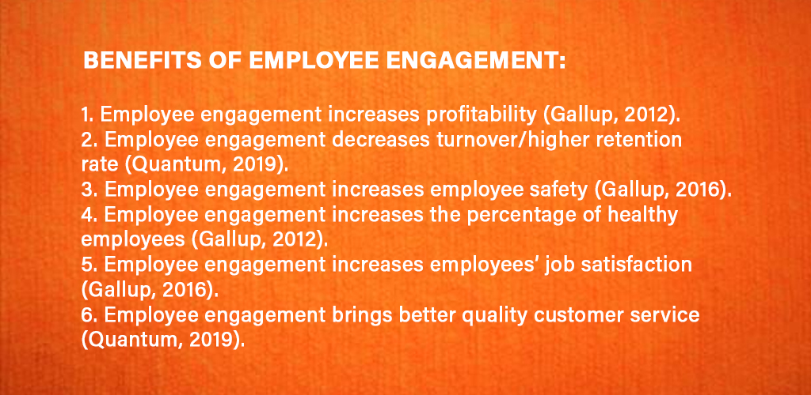

## Engagement and Employee Loyalty: a preamble
&nbsp;

As an organization grows, it is critical to measure how committed employees are to the company and how well they collaborate. The best way to determine if employees are engaged in their jobs is to check employee engagement and see whether your team-building activities and human resources practices are contributing to positive business results or if they need to be changed. According to Gallup research, only 15% of workers are engaged in their jobs. In other words, engaged employees are hard to find.

Engaged workers are known to exert discretionary effort, which distinguishes them from those who are disengaged. This group of employees works hard, goes above and beyond, and is dedicated to the company's goals. They are innovators who make a difference to the company. Conversely, disengaged employees are less likely to commit to and engage with your company, and that is why they can negatively affect it. Apart from not enjoying their jobs, they intend to voice their displeasure. They occupy managers' time and reduce sales. Engaged employees will solve problems, innovate, and acquire new customers, but actively disengaged employees will undermine those efforts.

The miracle drug for workplace challenges is employee engagement. It is said, when employees are loyal to an organization, they tend to bring benefits with them.

_Image by: Mara Chequer_

! If you want to read more about how Employee Engagement decreases turnover/higher retention rate go to the following [Link](https://www.quantumworkplace.com/future-of-work/13-statistics-that-reveal-the-shocking-price-of-employee-turnover-and-how-to-combat-it).

We will continue to explore employee engagement in the units that follow and how Stewardship practices can create loyalty within any organization. The concept of employee loyalty refers to employees who are committed to the success of their organization and believe that their involvement in such an organization is in their best interests.

Employee loyalty has many definitions and it is important that you are able to critically analyze the link between employee engagement, stewardship and loyalty. Generally, employee loyalty refers to the emotions that motivate employees to stay with their current employer and are less likely to look for better employment opportunities elsewhere.

Later, you will learn how loyalty is segmented, the levels of loyalty, and how they all work together to make a successful culture.

!!! Think:  Do you know of any organization that has loyal employees? What motivates them? In what way are they loyal?

Based on the assigned readings by Peters, in Chapter 1 (pp. 9-11), there is no single definition of employee engagement, but there is wide agreement that it is an emotional commitment to one’s work and a willingness to give of one’s best at work. It is how people feel about their work that determines their levels of energy, ownership, persistence, commitment and initiative.

#### Signs of high engagement include:

- the extent to which employees commit to achieving results and how hard they work;
- a passion and purpose for what they do and a sense that they are contributing to something bigger than themselves, i.e. they want to make a positive difference to something;
- how much initiative people take;
- a high level of innovation and effort to assist a company or unit in the company to reach its goals/strategy;
- the high, positive energy and enthusiasm with which people approach their work;
- the level of ownership and involvement with their work that people display;
- a willingness to take on a new challenge;
- a receptiveness and openness to change;
the high standards people set for themselves in terms of their conduct at work, the quality of their work and the pride people take in their work;
- a focus on the customer or client and meeting their needs;
- efforts made to learn more about their field so they can do more and be more innovative;
- a willingness to be collaborative with colleagues in an effort to leverage others’ skills and the inputs that are needed to deliver a quality result or to solve a problem quickly;
- how long a person perseveres when things are not going well; and
- the extent to which people are prepared to “go the extra mile”. When employees care, i.e. when they are engaged, they put in the extra effort needed to resolve a customer’s problem, make sure the new process is working, or sort out a quality problem on the line. This is referred to as “discretionary effort”; it is the level of effort people could give if they wanted to, above and beyond the minimum required.

!!! **Critical Thinking:** Do you know of any organization that has loyal employees? What motivates them? In what way are they loyal?

We will continue to explore employee engagement in the units that follow and how Stewardship practices can create loyalty within any organization.

&nbsp;

## Employee Loyalty

An employee who is loyal to their organization is one who is committed to its success and believes that participating in such an organization is in their best interests. The concept of employee loyalty refers to employees who are committed to the success of their organization and believe that their involvement in such an organization is in their best interests. Employee loyalty is a key component to successful employee engagement at the workplace.

Employee loyalty  has many definitions and it is crucial that you are able to critically analyze the link between employee engagement, stewardship and loyalty. Generally, employee loyalty refers to the emotions that motivate employees to stay with their current employer so they are less likely to look for better employment opportunities elsewhere.

Later, you will learn how loyalty is segmented, the levels of loyalty, and how they all work together to make a successful culture.
