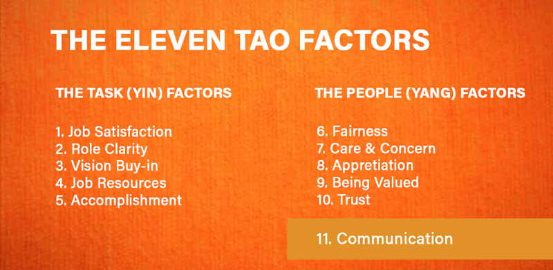

## The Eleven Tao Factors
&nbsp;

Rao (2006) proposes that eleven key factors should be managed in order to establish and maintain a high percentage of loyal employees. Rao introduces a simple quiz to get a quick sense of an employee’s loyalty level.

!!! The percentage of employee loyalty will be high if the organization scores highly with all eleven factors.

Job Satisfaction, Role Clarity, Buy-in to Vision/Mission/Values, Resources, Accomplishments, Appreciation, Valued, Fairness, Trust, Care, Concern, and Communication make up the 11 key factors.

These eleven factors fall into two categories, Task-oriented and People-oriented. They represent the yin and yang of employee loyalty that must be understood, addressed, and managed in order to produce truly loyal employees.

_Image by: Mara Chequer_

In the new and fast-changing marketplace, organizations must make the fifth “P” -People, specifically their employees a high priority to succeed. Identifying, measuring, and understanding their Employee Loyalty Levels is a critical first step.

Rao believes that **Employee Engagement and Employee Emotional Loyalty** are two sides of the same coin. Both are measurables of how to get the best out of each employee. However, there are two significant differences worth noting:

1. Engagement focuses on effectively engaging the employee in the workplace, thereby getting the most efficiency out of them, making them more effective for the organization. Rao (2006) calls this an “inside-out view, focusing on the employee first. Emotional Loyalty focuses on the organization from the employee’s perspective, asking “Why should the employee feel bonded with the organization?” Rao says this is an outside-in view.

2. If engagement is a selfish view where the organization is asking, “How can I get the best out of my employee?

In the case of emotional loyalty, the question is asked from the perspective of, what should I do to create a highly positive and nurturing environment for the employee, so that they will give everything they have to the organization? Creating and nurturing Employee Emotional Loyalty is in keeping with the values and practices of Transformational Servant Leadership (TSL). An organization's employees carry out its mission and vision every day. They are instrumental to the organization's success.

&nbsp;
:fa-bookmark: _If you are interested in the knowledge/understanding of TSL values and practices, you can consult materials from LDRS 500 and MA in Lead Resources on Moodle._
