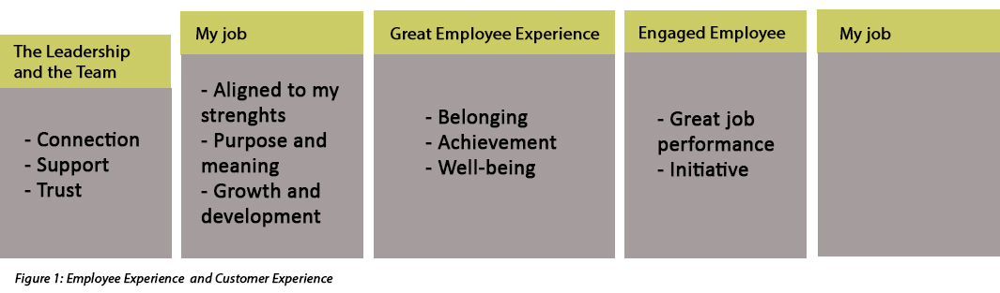
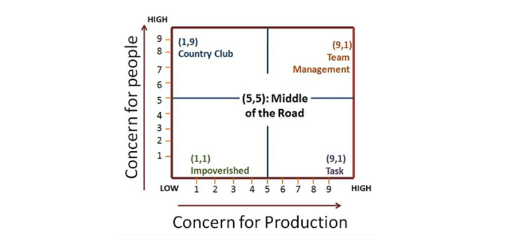

## Managerial Grid: The task and People Factors
&nbsp;

Source: Peters, J. (2019). Employee Engagement: Creating High Positive Energy at Work. (p.5)

As Peters points out in the figure above, Tao's employee loyalty model is highly connected to customer experience in organizations. The concepts will be connected to the Managerial Grid developed by Blake and Mouton.

Robert Blake and Jane Mouton (1964 & 1985) developed the Managerial Grid, also called a leadership grid. According to them, the leadership styles can be identified based on the manager’s concern for people and production (i.e. tasks at hand).
Concern for people, in this context, means how committed an individual is to goal achievement, maintaining their self-esteem as employees, and satisfying their interpersonal relationships. The concern for production refers to an attitude of superiors towards the quality of procedures and policies, creativity in research, effectiveness of staff, work efficiency, and volume of output.

This figure illustrates the five leadership styles identified by the managerial grid based on two behavioral dimensions:

In the figure, there are 81 possible categories where the leader’s style may fall.

- Impoverished Management (1,1): The managers with this leadership style exert minimum effort to get the work done by the subordinates. They have minimal concern for both the people and production and they function merely to preserve their jobs and seniority. Therefore, disharmony, dissatisfaction, disorganization arises within the organization.

- Task Management (9,1): Here, the leader is more concerned with the production and lays less emphasis on the personal needs of his subordinates. This leadership style is also called a dictatorial or perish style, where the subordinates are required to perform the task as directed by the superiors. In this leadership style, the output in the short run may increase drastically, but due to stringent rules and procedures, there could be a high labor turnover.

- Middle of the Road (5,5): The manager with this style tries to keep a balance between the organizational goals and the personal needs of his subordinates. Here, the leader focuses on adequate performance through a balance between the work requirements and satisfactory morale. Both the people and production needs are not completely met, and thus the organization land up to an average performance.

- Country Club (1,9): Here, the leader lays more emphasis on the personal needs of the subordinates and gives less attention to the output. The manager adopts this style of leadership with the intent to have a friendly and comfortable working environment for the subordinates, who get self-motivated and work harder on their own. However, less attention to the production can adversely affect the work goals and may lead to unsatisfactory results.

- Team Management (9,9): According to Blake and Mouton, it is the most effective leadership style wherein the leader takes both people and production hand in hand. This style is based on McGregor’s Theory Y, where the employees are believed to be committed towards the goal achievement and need not require the manager’s intervention at every step. The leader with this style feels that empowerment, trust, respect, commitment helps in nurturing the team relationships, which ultimately results in the increased employee satisfaction and overall production of the organization.

Thus, the managerial grid is a graphical representation of different leadership styles that managers adopts while dealing in the industrial settings. (Source: [Link here](https://businessjargons.com/blake-moutons-managerial-grid.html))
