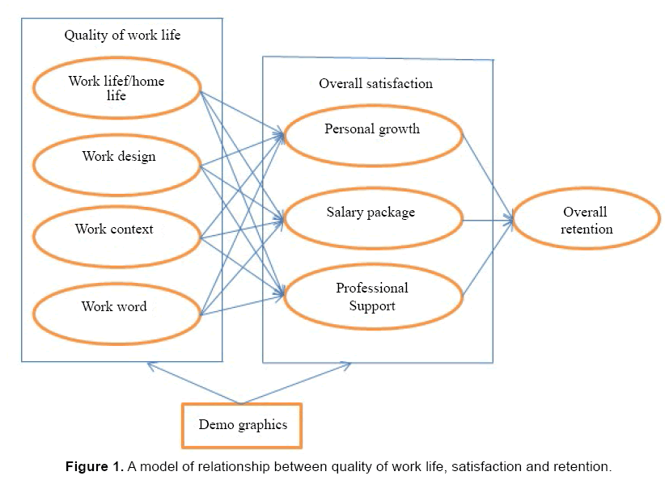

#### Learning Activity 3.2: Reading - Quality of Work life

:fa-bookmark: This topic is best understood by reading the Research Article “Quality of Work Life: The Determinants of Job Satisfaction and Job Retention among RNs and OHPs” This study examines the healthcare industry (public and private) in several countries including Saudi Arabia, where nurses and other health care professionals often experience high turnover, and explains the connection between quality of work life (QWL), satisfaction, and retention.

Parveen, M., Maimani, K., Kassim, N. (2017). Quality of work life: The determinants of job satisfaction and Job retention among RJs and OHPs. International Journal for Quality Research, 11(1), 173-194. (Assigned Article #1). [Link here](https://www.omicsonline.org/open-access/quality-of-work-life-the-determinants-of-job-satisfaction-and-jobretention-among-rns-and-ohps-1522-4821-1000327.php?aid=76579).

Use the following diagram to examine factors involved in the relationship between quality of life, satisfaction and job retention suggested by the article (p. 174).

:fa-comments: _This learning activity will help you build your knowledge of the topic and will be addressed in class or during your work assignments._
