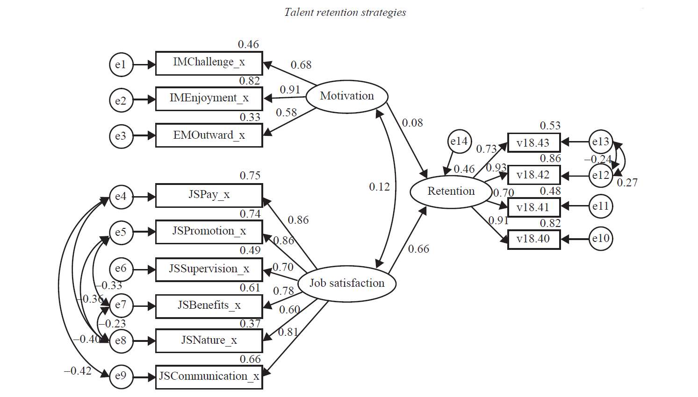

:fa-bookmark: Reading the article (Assigned Article #2) linked below will help you better understand the topic of staff retention. An investigation into employee motivation and job satisfaction was conducted at a foreign exchange bank as a predictor of staff retention. _Please note that you will need to log in with the institution credentials to access the full article._

Sabbagha, M. D.S., Ledimo, O., Martins, N. (2018). Predicting staff retention from employee motivation and job satisfaction. Journal of Psychology in Africa. 28(2), 136-140. [Assigned Article No.2](https://doi.org/10.1080/14330237.2018.1454578)

Use the following diagram to examine factors involved in the relationship between staff retention, motivation, and job retention suggested by the article (p. 139).

:fa-comments: _This learning activity will help you build your knowledge of the topic and will be addressed in class or during your work assignments._
