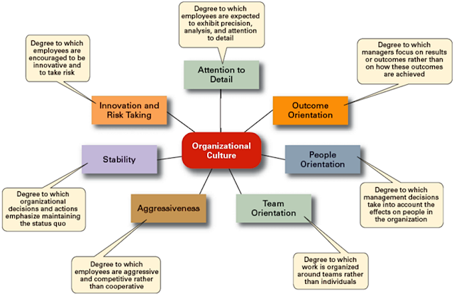

## Organizational culture, Leadership, and Employee Performance and Satisfaction
 

An organization's culture plays an important role. Think about the impact of culture on employee performance and satisfaction using the following.  An organization's culture plays a major role in employee engagement.  The culture of an organization may be supportive/unsupportive or positive/negative. In organizations with a positive culture, employees are rewarded and an enabling environment is created where they can grow, develop, and perform at their best (Robbins & Judge, 2012).

View the graph below to understand the possible dimensions of organizational culture.

_Source: Robins, S., Coulter, M. (2007). Organizational culture and environment: The constraints. Management (11th Ed.), (p. 3). US: Prentice Hall Publishing.7_

 

The following graph, is a  to understand the role organizational culture plays in employee engagement and job satisfaction.  

_Source: Source: Robins, S., Judge, T. (2011). Organizational culture. in Organizational Behavior (14th Ed.), Power Point Slides (p.18). US: Prentice Hall Publishing._

 

The third graph is shown to help you understand the complexity of leadership, including self-awareness and leadership style in the process of changing organizational culture.

_Source: Crowell, D. (2016). Complexity leadership: Nursing’s role in healthcare delivery (2nd Ed.). (page 5). F.A. Advis Company._ [https://eds.a.ebscohost.com](https://eds.a.ebscohost.com/eds/ebookviewer/ebook/bmxlYmtfXzEwODMxMTBfX0FO0?sid=710738ed-2932-46cb-b502-e0937a42006f@sessionmgr4007&vid=0&format=EB&rid=7)

:fa-comment: Please complete Learning Activity 4.3 and include your response to the questions in the Assignment 1 submission.
